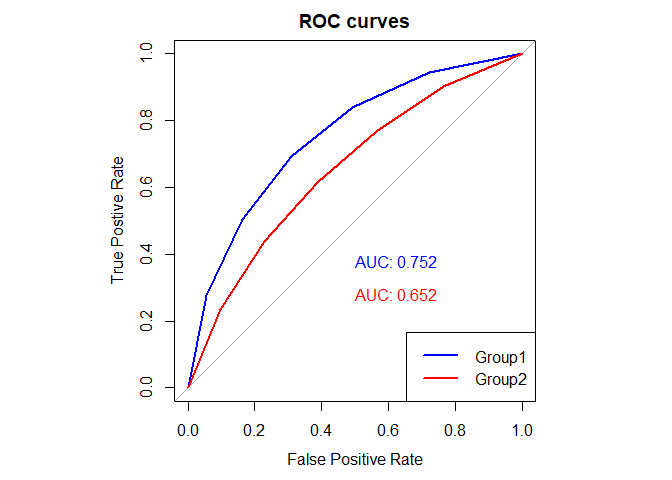
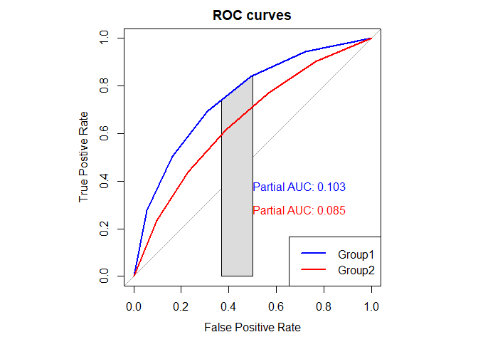

<!-- README.md is generated from README.Rmd. Please edit that file -->

# ROCpower

<!-- badges: start -->
<!-- badges: end -->

The goal of ROCpower is to examine the sample sizes required to conduct
the NHST, Minimum-effect tests, and equivalence tests for Receiver
Operating Characteristic curves

## Installation

You can install the development version of ROCpower like so:

``` r
install_github("PaulRiesthuis/ROCpower")
```

## Example single ROC curve

To visualize the full or partial ROC curves and AUCs for parameters of
interest

``` r
library(ROCpower)
# For single curve, use group1 parameters.
# Visualize full ROC curves and AUCs. n_g1 is intentionally large to have precise estimates. rho doesnt affect the AUC.
visualize_full_roc(mean_signal_g1 = 1, mean_signal_g2 = 0.58,
                   n_studied = 5, n_new = 5,
                   n_g1 = 10000,
                   sd_signal_g1 = 1, sd_signal_g2 = 1,
                   sd_noise_g1 = 1, sd_noise_g2 = 1,
                   mean_noise_g1 = 0, mean_noise_g2 = 0,
                   rho = 0, seed = 2794)
```



    #> $roc_g1
    #> 
    #> Call:
    #> roc.default(response = labels, predictor = ratings_g1, direction = "<")
    #> 
    #> Data: ratings_g1 in 50000 controls (labels 0) < 50000 cases (labels 1).
    #> Area under the curve: 0.7521
    #> 
    #> $roc_g2
    #> 
    #> Call:
    #> roc.default(response = labels, predictor = ratings_g2, direction = "<")
    #> 
    #> Data: ratings_g2 in 50000 controls (labels 0) < 50000 cases (labels 1).
    #> Area under the curve: 0.6519

    # Visualize partial ROC curves and AUCs. n_g1 is intentionally large to have precise estimates. rho doesnt affect the AUC.
    visualize_partial_roc(mean_signal_g1 = 1, mean_signal_g2 = 0.58,
                       n_studied = 5, n_new = 5,
                       n_g1 = 10000,
                       sd_signal_g1 = 1, sd_signal_g2 = 1,
                       sd_noise_g1 = 1, sd_noise_g2 = 1,
                       mean_noise_g1 = 0, mean_noise_g2 = 0,
                       pauc = c(.63,.50),
                       rho = 0, seed = 2794)



    #> $roc_g1
    #> 
    #> Call:
    #> roc.default(response = labels, predictor = ratings_g1, direction = "<",     partial.auc = pauc)
    #> 
    #> Data: ratings_g1 in 50000 controls (labels 0) < 50000 cases (labels 1).
    #> Partial area under the curve (specificity 0.63-0.5): 0.1031
    #> 
    #> $roc_g2
    #> 
    #> Call:
    #> roc.default(response = labels, predictor = ratings_g2, direction = "<",     partial.auc = pauc)
    #> 
    #> Data: ratings_g2 in 50000 controls (labels 0) < 50000 cases (labels 1).
    #> Partial area under the curve (specificity 0.63-0.5): 0.08524

To run a power analsysis for a single ROC curve

``` r
library(ROCpower)
## basic example code. Adjust the means and sds to get the ROC/AUC of interest.
simulate_single_roc(mean_signal = 0.34, mean_noise = 0,
                    sd_signal = 1, sd_noise = 1,
                    n_g = 100, n_studied = 5, n_new = 5,
                    n_simulations = 1000, SESOI = 0.55, seed = 2794)
#> The analysis yielded the following results:
#> 
#> 1. **NHST (Null Hypothesis Significance Testing):** 99.9% of simulations rejected the null hypothesis at the 0.05 level.
#> 2. **ET (Equivalence Testing):** 0% of simulations demonstrated equivalence within the specified SESOI.
#> 3. **MET (Minimum-Effects Testing):** 65.7% of simulations showed significant minimum effects in either direction relative to the SESOI.
#> 
#> ### **Power Analysis Report**
#> Based on a simulation-based power analysis (Riesthuis et al., 2025), using the following parameters:
#> 
#> #### **Group 1**
#> - Mean Signal: 0.34
#> - Signal SD: 1
#> - Mean Noise: 0
#> - Noise SD: 1
#> 
#> #### **Study Parameters**
#> - SESOI: 0.55
#> - Sample Size (n): 100
#> - Number of Studied Items: 5
#> - Number of New Items: 5
#> 
#> #### **Simulation Parameters**
#> - Number of Simulations: 1000
#> - Set Seed: 2794
```

## Example power analysis for difference between full ROC curves

To run a power analysis for difference between full ROC curves

``` r
library(ROCpower)
## basic example code. Adjust the means, sds, sample sizes for each group, and the correlation to get the ROC/AUC of interest.
simulate_two_roc(mean_signal_g1 = 1, mean_signal_g2 = 0.58,
                 mean_noise_g1 = 0, mean_noise_g2 = 0,
                 sd_signal_g1 = 1, sd_signal_g2 = 1,
                 sd_noise_g1 = 1, sd_noise_g2 = 1,
                 n_g1 = 100, n_g2 = 100,
                 n_studied = 5, n_new = 5,
                 n_simulations = 1000, SESOI = 0.05,
                 paired = FALSE, rho = 0.5, seed = 2794)
#> The analysis yielded the following results:
#> 
#> 1. **NHST (Null Hypothesis Significance Testing):** 99.5% of simulations rejected the null hypothesis at the 0.05 level.
#> 2. **ET (Equivalence Testing):** 0% of simulations demonstrated equivalence within the specified SESOI.
#> 3. **MET (Minimum-Effects Testing):** 55.2% of simulations showed significant minimum effects in either direction relative to the SESOI.
#> 
#> ### **Power Analysis Report**
#> Based on a simulation-based power analysis (Riesthuis et al., 2025), using the following parameters:
#> 
#> #### **Group 1**
#> - Mean Signal: 1
#> - Signal SD: 1
#> - Mean Noise: 0
#> - Noise SD: 1
#> - Sample Size (n total if paired): 100
#> 
#> 
#> #### **Group 2**
#> - Mean Signal: 0.58
#> - Signal SD: 1
#> - Mean Noise: 0
#> - Noise SD: 1
#> - Sample Size: 100
#> 
#> 
#> #### **Study Parameters**
#> - SESOI: 0.05
#> - paired = FALSE
#> - Number of Studied Items: 5
#> - Number of New Items: 5
#> - Correlation: 0.5
#> 
#> #### **Simulation Parameters**
#> - Number of Simulations: 1000
#> - Set Seed: 2794
```

## Example power analysis for difference between partial ROC curves

To run a power analysis for difference between partial ROC curves

``` r
library(ROCpower)
## basic example code. Adjust the means, sds, sample sizes for each group, and the correlation to get the ROC/AUC of interest.
simulate_two_partial_roc(mean_signal_g1 = 1, mean_signal_g2 = 0.58,
                         mean_noise_g1 = 0, mean_noise_g2 = 0,
                         sd_signal_g1 = 1, sd_signal_g2 = 1,
                         sd_noise_g1 = 1, sd_noise_g2 = 1,
                         n_g1 = 100, n_g2 = 100,
                         n_studied = 5, n_new = 5,
                         pauc = c(.63,.50),
                         n_simulations = 3, SESOI = 0.05,
                         paired = FALSE, rho = 0.5, seed = 2794)
#> The analysis yielded the following results:
#> 
#> 1. **NHST (Null Hypothesis Significance Testing):** 100% of simulations rejected the null hypothesis at the 0.05 level.
#> 2. **ET (Equivalence Testing):** 100% of simulations demonstrated equivalence within the specified SESOI.
#> 3. **MET (Minimum-Effects Testing):** 0% of simulations showed significant minimum effects in either direction relative to the SESOI.
#> 
#> ### **Power Analysis Report**
#> Based on a simulation-based power analysis (Riesthuis et al., 2025), using the following parameters:
#> 
#> #### **Group 1**
#> - Mean Signal: 1
#> - Signal SD: 1
#> - Mean Noise: 0
#> - Noise SD: 1
#> - Sample Size (n total if paired): 100
#> 
#> #### **Group 2**
#> - Mean Signal: 0.58
#> - Signal SD: 1
#> - Mean Noise: 0
#> - Noise SD: 1
#> - Sample Size: 100
#> 
#> 
#> #### **Study Parameters**
#> - SESOI: 0.05
#> - pAUC: (0.63 - 0.5)
#> - paired = FALSE
#> - Number of Studied Items: 5
#> - Number of New Items: 5
#> - Correlation: 0.5
#> 
#> #### **Simulation Parameters**
#> - Number of Simulations: 3
#> - Set Seed: 2794
```
